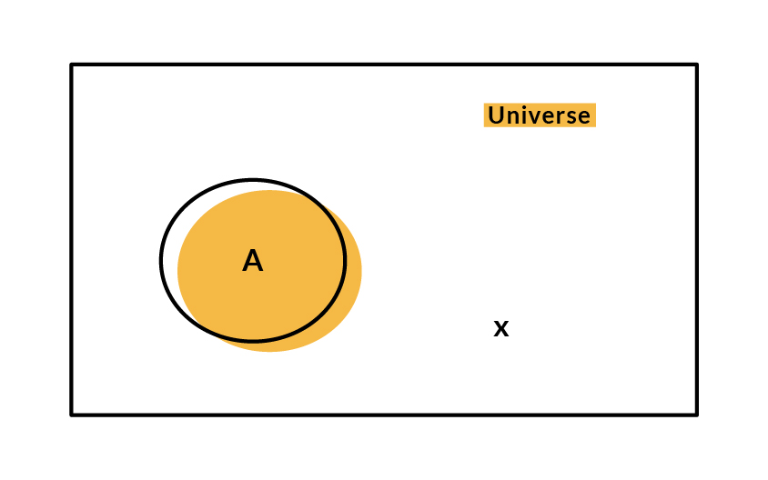
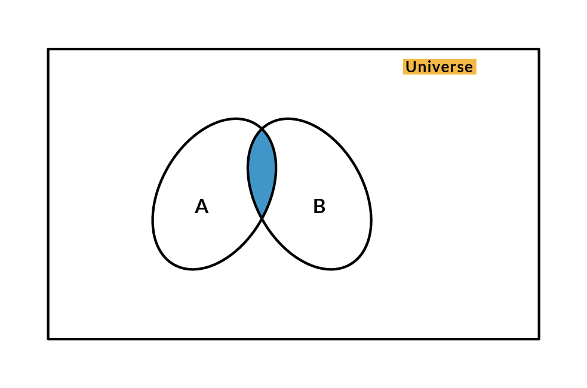
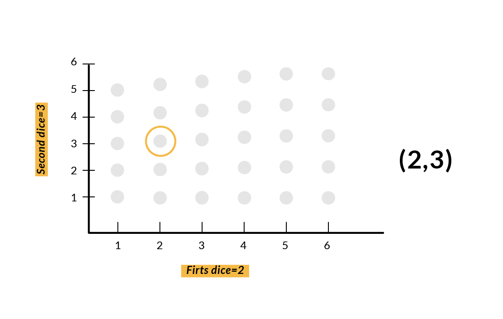
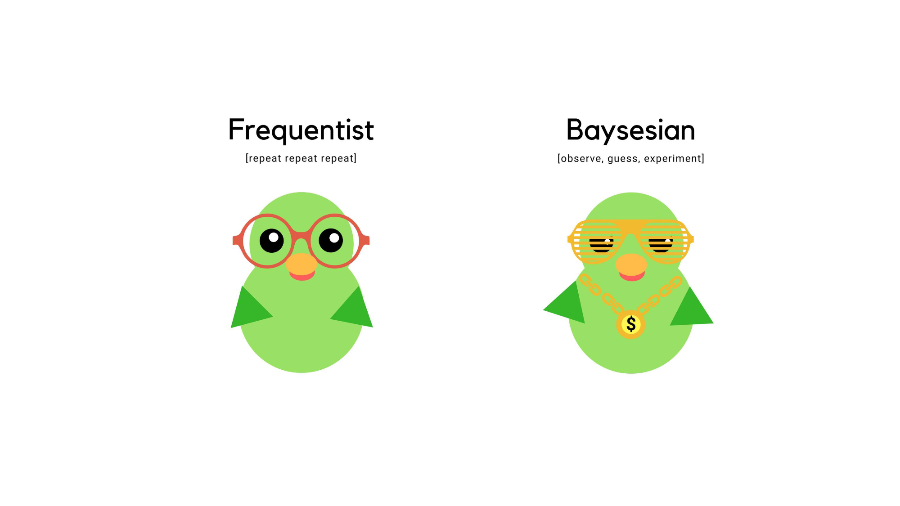

# Probabilidad

### Antecedentes Matemáticos

**Sets (conjuntos)**

Cuando tenemos diferentes elementos y los ponemos juntos, hacemos una colección, la cual es denominada "Set".

Hay dos tipos de conjuntos:

1. Sets finitos: Tiene un número finito de elementos. Por ejemplo, un conjunto que incluye números entre 10 y 20.
2. Sets infinitos: Por ejemplo, un conjunto de todos los números reales.

Todo lo que está fuera del Set A lo llamamos complemento del Set A. Un elemento x pertenece al complemento de A si x es un elemento de nuestro Set universal, y además no pertenece a A.

Ahora cuando tenemos dos Sets A y B, podemos hablar de su unión e intersecciones.

La **unión** de los dos Sets consiste en todos los elementos que pertenecen a un Set o al otro (o a ambos). Entonces, un elemento pertenece a la unión si y solo si este elemento pertenece a uno de los conjuntos, o pertenece al otro de los conjuntos.

La **intersección** de dos Sets es la colección de elementos que pertenecen a ambos Sets. Entonces, un elemento pertenece a la intersección de dos Sets si y solo si ese elemento pertenece a ambos.

**Secuencias**

Una secuencia es una colección de elementos que salen de algún set y esa colección está indexada por los números naturales.

Queremos decir que tenemos $i$ y $ai$ donde $i$ es un índice que corre sobre los números naturales (que es el set de enteros positivos), y cada $ai$ es un elemento de algún set. Formalmente, una secuencia es una función que, a cualquier número natural, asocia un elemento de $S$. Normalmente nos preocupamos por si una secuencia converge a algún número $a$. El límite cuando $i$ tiende al infinito de $ai$ es igual a un cierto número, $a$.

Pero, ¿qué significa exactamente que una secuencia converja?

No importa qué tipo de banda tome alrededor de mi límite $a$, eventualmente, la secuencia estará dentro de esta banda y permanecerá allí. Por ejemplo, si una determinada secuencia converge a un número a y otra secuencia converge a un número $b$, tendremos que $ai + bi$ (que es otra secuencia) convergerán a $a+b$.

Pero, ¿cómo podemos saber si una secuencia dada converge o no?

Tenemos dos casos:

1. El primero, cuando tenemos una secuencia de números que van aumentando. Esos números pueden subir para siempre sin ningún límite. En ese caso decimos que la secuencia converge a infinito.

2. Pero si no converge al infinito, lo que significa es que las entradas de la secuencia están acotadas, entonces en ese caso, la secuencia convergerá a un cierto número.

**Series Infinitas**

Tenemos una secuencia de números $ai$, indexada por $i$, donde $i$ va desde $1$ hasta el infinito. Entonces tenemos una secuencia infinita. Queremos sumar los términos de esa secuencia.

Entonces, ¿qué es una serie infinita?

La serie infinita se define como el límite, cuando $n$ tiende a infinito de la serie finita en la que sumamos solo los primeros $n$ términos de la serie. La situación es más complicada si los términos $ai$ pueden tener signos diferentes. En ese caso, es posible que el límite no exista, por lo que la serie no está bien definida.

**Sets Contables vs No Contables**

Los modelos de probabilidad a menudo involucran sets de muestras infinitas. Algunos sets son discretos (a los que llamamos contables) y algunos son continuos (a los que llamamos incontables). De esta manera, eventualmente agotaremos todos los elementos del set, de modo que cada uno corresponda a un número entero positivo.

¿Qué sería un set incontable?

Es un set que no se puede contar. Siempre que tengamos un intervalo unitario o cualquier otro intervalo que tenga una longitud positiva, es considerado un set incontable. Y si en lugar de un intervalo, miramos toda la línea real o dos, tres o más espacios dimensionales; entonces todos los sets usuales que consideramos sets continuos resultan ser incontables también.

### Probabilidad

Hoy en día, no hay mucho que podamos entender sobre lo que sucede a nuestro alrededor, a menos que entendamos la incertidumbre. Es fácil formular proposiciones sin incertidumbre, pero los problemas aparecen cuando la incertidumbre se manifiesta.

Un modelo probabilístico es un modelo de un experimento aleatorio y puede ayudarte a analizar situaciones inciertas sin importar cuál sea su experiencia única.

Primero describimos los posibles resultados del experimento y luego describimos la probabilidad de los diferentes resultados posibles. Esta combinación se llama espacio de probabilidad, que es el par $(S, P)$ donde $S$ es el espacio muestral y $P$ es la distribución de probabilidad.

Imaginemos que lanzamos una moneda. El espacio de probabilidad es $(S, P)$. Formamos un SET de los posibles resultados. Ese conjunto se llama **espacio muestral** de todos los eventos elementales. Su **distribución de probabilidad** consiste en asignar un número real $p(x)$ a todo evento elemental $X$ tal que su probabilidad esté entre $0$ y $1$ y la suma de todas estas probabilidades sea igual a $1$.

$S = {cara, cruz}$ donde $S$ puede ser cara o cruz, por lo que la probabilidad es $P(cara) = P(cruz) = 1/2$

La probabilidad de cara es la misma que la probabilidad de cruz, que es igual a $0,5$. Entonces, si lanzas una moneda al aire, existe la misma posibilidad de que salga cara o de que salga cruz.

Ahora imaginemos que tenemos una buena tirada de dados. Tenemos $6$ resultados posibles si lanzamos un dado: { 1, 2, 3, 4, 5, 6}. Si es una tirada de dados justa, entonces cada uno de esos posibles resultados tiene la misma probabilidad, que sería:

El número de posibilidades que cumplen mi condición / número de posibilidades igualmente probables.

$P(1) = 1/6$

$P(1 o 6) = 2/6$

$p(2 y 3) = 0/6$ ------> obtener $2$ o $3$ son eventos mutuamente excluyentes. No pueden ocurrir al mismo tiempo.

Una distribución de probabilidad se considera uniforme si todos los resultados son igualmente probables.

Los espacios muestrales son sets, y un set puede ser discreto, finito, infinito, continuo, etc. 

Veamos un ejemplo de un espacio muestral discreto y finito simple.

Lanzaremos un dado dos veces (no estamos tratando con dos experimentos probabilísticos, es un solo experimento que implica dos lanzamientos del dado). Luego tomamos nota del primer resultado, y después tomamos nota del segundo resultado. Esto nos da un par de números y se grafican de la siguiente manera:

### ¿Por qué probabilidad?

En muchos casos, es más práctico usar una regla simple pero incierta en lugar de una regla compleja pero cierta, incluso si la regla verdadera es determinista y nuestro sistema de modelado tiene la fidelidad para adaptarse a una regla compleja.

Por ejemplo, la regla simple "La mayoría de las aves vuelan" es **económica** de desarrollar y es ampliamente útil, mientras que una regla de la forma "Las aves vuelan, excepto las aves muy jóvenes que aún no han aprendido a volar, enfermas o lesionadas, aves que han perdido la capacidad de volar, especies de aves que no vuelan, incluidos el casuario, el avestruz y el kiwi..." es **cara** de desarrollar, mantener, comunicar y después de todo este esfuerzo, sigue siendo **frágil* * y propenso al **fracaso**.

La probabilidad puede verse como la extensión de la lógica para hacer frente a la incertidumbre.

La teoría de la probabilidad proporciona un set de reglas formales para determinar la probabilidad de que una proposición sea verdadera dada la probabilidad de otras proposiciones.

### Tipos de probabilidad

**Probabilidad Frecuentista:**

•	Frecuencia de eventos. Ejemplo: La posibilidad de sacar una determinada mano en el póquer.

•	Modelo fijo, datos diferentes. (Ejecutamos los mismos experimentos cada vez con datos diferentes)

**Probabilidad Bayesiana:**

•	Un grado de creencia. Ejemplo: cuando un médico que dice que un paciente tiene un 40% de posibilidades de tener gripe.

•	Datos fijos y diferentes modelos. (Usamos la misma creencia para comprobar la incertidumbre de diferentes modelos y actualizar nuestras creencias) -Basado en la Regla de Bayes.

**Diferencias entre estadística bayesiana y frecuentista.**

Ambos intentan estimar un parámetro de población basado en una muestra de datos.

Los frecuentistas tratan los datos como aleatorios y la estadística como fija. Las inferencias se basan en un muestreo infinito a largo plazo, y las estimaciones del parámetro vienen en forma de estimaciones puntuales o intervalos de confianza.

Los Bayesianos tratan el parámetro de población como aleatorio y los datos como fijos. Las estadísticas Bayesianas nos permiten hacer conjeturas informadas sobre el valor del parámetro en forma de distribuciones previas. Las estimaciones del parámetro vienen en forma de distribuciones posteriores.

### Eventos

Un evento es un set de resultados de un experimento en probabilidad.

En la probabilidad Bayesiana, un evento se define como la descripción del siguiente espacio de estado posible utilizando el conocimiento del estado actual.

Los eventos pueden ser :

•	Independiente - cada evento no se ve afectado ni por los eventos anteriores o futuros.

•	Dependiente - un evento se ve afectado por otros eventos.

•	Mutuamente excluyentes - los eventos no pueden ocurrir al mismo tiempo.

El complemento de un evento son todos los demás resultados de un evento. Por ejemplo, si el evento es Cruz, el complemento es Cara. Si conoces la probabilidad de $p(x)$, puedes encontrar el complemento haciendo $1 - p(x)$. A veces es más fácil calcular primero el complemento antes que la probabilidad real.

### La Probabilidad Condicional

La probabilidad condicional de un evento $B$ es la probabilidad de que ocurra el evento dado que el evento $A$ ya ha ocurrido.

Si $A$ y $B$ son dos eventos, entonces la probabilidad condicional se puede designar como $P(A dado B)$ o $P(A|B)$. La probabilidad condicional se puede calcular a partir de la probabilidad conjunta $(A | B) = P(A, B) / P(B)$. (La probabilidad condicional no es simétrica).

Por ejemplo: $P(A | B) != P(B | A)$

Otras formas de calcular la probabilidad condicional incluyen el uso de la otra probabilidad condicional, es decir:

$P(A|B) = P(B|A) * P(A) / P(B)$ ----->Bayes Theorem

También se usa el reverso:

$P(B|A) = P(A|B) * P(B) / P(A)$

Esta forma de cálculo es útil cuando es difícil calcular la probabilidad conjunta. De lo contrario, cuando la probabilidad condicional inversa está disponible, el cálculo a través de esto se vuelve fácil.

Este cálculo alternativo de probabilidad condicional se denomina Regla de Bayes o Teorema de Bayes.

**Teorema de Bayes**

El teorema de Bayes es una fórmula matemática simple utilizada para calcular probabilidades condicionales. Este teorema establece que:

$P(A|B) = P(B|A) * P(A) / P(B)$

El teorema de Bayes se usa para el cálculo de una probabilidad condicional donde la intuición a menudo falla. Aunque se usa ampliamente en probabilidad, el teorema también se está aplicando en el campo de Machine Learning.

Su uso en Machine Learning incluye el ajuste de un modelo a un DataSet (conjunto de datos) de entrenamiento y el desarrollo de modelos de clasificación.

Siempre es posible responder preguntas de probabilidad condicional mediante el Teorema de Bayes. Nos dice la probabilidad del evento A dada alguna nueva evidencia B, pero si lo olvidaste, siempre puedes cultivar historias con árboles podados.

Ejemplo:

Los incendios peligrosos son raros (1 %), pero el humo es bastante común (10 %) debido a las barbacoas, y el 90 % de los incendios peligrosos producen humo.

¿Cuál es la probabilidad de un Incendio peligroso cuando hay Humo?

Cálculo

$P(Fire|Smoke) =P(Fire) P(Smoke|Fire)/P(Smoke)$

= 1% x 90%/10%

= 9%

**Teorema de Bayes en Machine Learning**

El teorema de Bayes se puede utilizar tanto en regresión como en clasificación.

Generalmente, en Machine Learning supervisado, cuando queremos entrenar un modelo, los componentes principales son:

- Un set de puntos de datos que contienen características (los atributos que definen dichos puntos de datos)

- Las etiquetas de dicho punto de datos (El tag numérico o categórico que luego queremos predecir en nuevos puntos de datos)

- Una función de hipótesis que vincula dichas características con sus etiquetas correspondientes.

- También tenemos una función de pérdida, que es la diferencia entre las predicciones del modelo y las etiquetas reales que queremos reducir para lograr los mejores resultados posibles.

Referencias:

https://medium.com/brandons-computer-science-notes/an-introdcution-to-probability-45a64aee7606

https://discovery.cs.illinois.edu/learn/Prediction-and-Probability/Conditional-Probability/

https://www.upgrad.com/blog/bayes-theorem-explained-with-example-complete-guide/

https://www.edx.org/es/micromasters/mitx-statistics-and-data-science

https://towardsdatascience.com/bayes-theorem-clearly-explained-with-visualization-5083ea5e9b14

