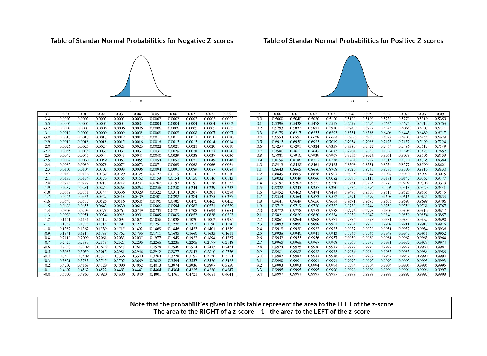

# Standard Normal Table

*This is not a lesson. Use this table as reference.*

The entries in this table provide the numerical values of (z) = P(Z <= z), where Z is a standard normal random variable, for z between 0 and 3.49. For example, to find (1.03) we look at the row corresponding to 1.0 and the column corresponding to 0.03 so that (1.03) = .8485. When z is negative, the value of (z) can be found using the formula (z) = 1 -  (-z).

Table was taken from the www.sixsigmastrudyguide.com

Bell shaped curve was taken from www.mathisfun.com
