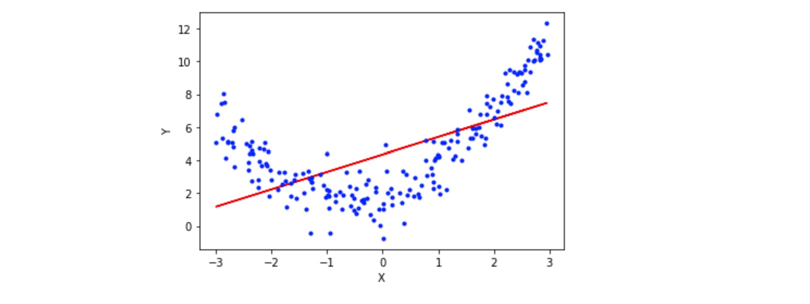
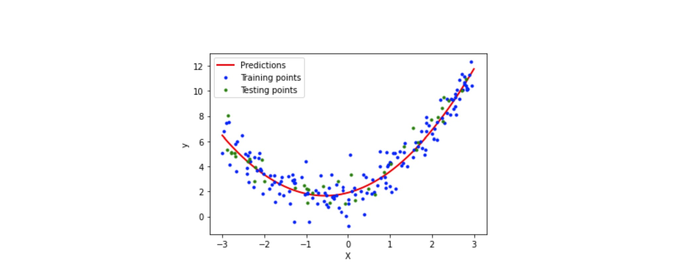

# Regresión Lineal

La regresión lineal es un algoritmo de Machine Learning básico pero súper poderoso. A medida que adquiera más y más experiencia con Machine Learning, notará que lo simple es mejor que lo complejo la mayor parte del tiempo. La regresión lineal se usa ampliamente en diferentes problemas de Machine Learning supervisado y se enfoca en el problema de regresión (el valor que deseamos que la predicción sea continua).

Modela la relación entre una sola variable dependiente (variable objetivo) y una (regresión simple) o más (regresión múltiple) variables independientes. El modelo de regresión lineal asume una relación lineal entre las variables de entrada y salida. Si esta relación está presente, podemos estimar los coeficientes requeridos por el modelo para hacer predicciones sobre nuevos datos.

¿Cuáles son los cinco supuestos de regresión lineal y cómo puede verificarlos?

1. Linealidad: el objetivo (y) y las características (xi) tienen una relación lineal. Para verificar la linealidad, podemos graficar los errores contra la 'Y' pronosticada y buscar que los valores se distribuyan simétricamente alrededor de una línea horizontal con varianza constante.

2. Independencia: los errores no están correlacionados entre sí. Para verificar la independencia, podemos trazar errores a lo largo del tiempo y buscar patrones no aleatorios (para datos de series temporales).

3. Normalidad: los errores se distribuyen normalmente. Podemos verificar la normalidad trazando los errores con un histograma.

4. Homoscedasticidad: la varianza del término de error es constante a través de los valores del objetivo y las características. Para verificarlo podemos graficar los errores contra la Y predicha.

5. Sin multicolinealidad: busca correlaciones superiores a ~0,8 entre características.

## Regresión lineal simple

La regresión lineal simple es un enfoque lineal para modelar la relación entre una variable dependiente y una variable independiente, obteniendo una línea que mejor se ajuste a los datos.

$y = a + bx$

Donde X es el vector de características, y a, b son los coeficientes que deseamos aprender. a es la intersección y b es la pendiente. La intersección representa el valor de y cuando x es 0 y la pendiente indica la inclinación de la línea. El objetivo es obtener la recta que mejor se ajuste a nuestros datos (la recta que minimice la suma de los cuadrados de los errores). El error es la diferencia entre el valor real y y el valor predicho y_hat, que es el valor obtenido usando la ecuación lineal calculada.

error = y(real) - y(predicted) = y(real) - (a+bx)

En la regresión lineal, cada valor dependiente tiene una sola variable independiente correspondiente que impulsa su valor. Por ejemplo, en la fórmula de regresión lineal de $y = 3x + 7$, solo hay un resultado posible de 'y' si 'x' se define como 2.

Para los curiosos, veamos cómo podríamos implementar la regresión lineal entre dos variables desde cero:

```py

import numpy as np
import matplotlib.pyplot as plt

# Regresión lineal desde cero
import random

# Crear datos de regresión
xs = np.array(range(1,20))
ys = [0,8,10,8,15,20,26,29,38,35,40,60,50,61,70,75,80,88,96]

# Poner datos en el diccionario
data = dict()
for i in list(xs):
    data.update({xs[i-1] : ys[i-1]})

# Pendiente
m = 0
# Y interceptar
b = 0
# Tasa de aprendizaje
lr = 0.0001
# Número de épocas
epochs = 100000   #----->Especifica el número de pases completos del conjunto de datos de entrenamiento a través del algoritmo.

# Fórmula para recta lineal
def lin(x):
    return m * x + b

# Algoritmo de regresión lineal
for i in range(epochs):
    # Elejir un punto aleatorio y calcular la distancia vertical y la distancia horizontal
    rand_point = random.choice(list(data.items()))
    vert_dist = abs((m * rand_point[0] + b) - rand_point[1])
    hor_dist = rand_point[0]

    if (m * rand_point[0] + b) - rand_point[1] < 0:
        # Ajustar la línea hacia arriba
        m += lr * vert_dist * hor_dist
        b += lr * vert_dist   
    else:
        # Ajustar la línea hacia abajo
        m -= lr * vert_dist * hor_dist
        b -= lr * vert_dist
        
# Trazar puntos de datos y línea de regresión
plt.figure(figsize=(15,6))
plt.scatter(data.keys(), data.values())
plt.plot(xs, lin(xs))
plt.title('Linear Regression result')  
print('Slope: {}\nIntercept: {}'.format(m, b))

```

 Slope (pendiente): 5.096261164108786
 Intercept (Interceptar): -8.549690202482191
    


La regresión lineal de Scikit-learn nos facilita la implementación y optimización de modelos de regresión lineal. Puedes ver la documentación de regresión lineal de scikit-learn aquí: https://scikit-learn.org/stable/modules/generated/sklearn.linear_model.LinearRegression.html

## Regresión lineal múltiple

La regresión lineal múltiple es un cálculo más específico que la regresión lineal simple. Para relaciones directas, la regresión lineal simple puede capturar fácilmente la relación entre las dos variables. Para relaciones más complejas que requieren más consideración, la regresión lineal múltiple suele ser mejor.

Una fórmula de regresión múltiple tiene varias pendientes (una para cada variable) y una intersección con el eje y. Se interpreta igual que una fórmula de regresión lineal simple, excepto que hay múltiples variables que afectan la pendiente de la relación. Debe usarse cuando múltiples variables independientes determinan el resultado de una sola variable dependiente.

$y =b₀+b₁x₁+b₂x₂+b₃x₃+…+bₙxₙ$

Las regresiones múltiples pueden ser lineales y no lineales. Las regresiones múltiples se basan en el supuesto de que existe una relación lineal entre las variables dependientes e independientes. También supone que no existe una correlación importante entre las variables independientes.

**¿La regresión polinomial es lo mismo que la regresión múltiple?**

La Regresión Polinomial es una forma de regresión lineal conocida como un caso especial de regresión lineal múltiple que estima la relación como un polinomio de grado n.

**¿Es una regresión polinomial no lineal?**

No. Es un modelo lineal que se puede usar para ajustar datos no lineales.

## Regresión lineal polinomial

La regresión polinomial se deriva utilizando el mismo concepto de regresión lineal con pocas modificaciones para aumentar la precisión. El algoritmo de regresión lineal simple solo funciona cuando la relación entre los datos es lineal, pero supongamos que tenemos datos no lineales, entonces la regresión lineal no podrá dibujar una línea de mejor ajuste.

**¿Cómo resuelve la regresión polinomial el problema de los datos no lineales?**

La regresión polinómica es una forma de regresión lineal en la que solo debido a la relación no lineal entre las variables dependientes e independientes, agregamos algunos términos polinómicos a la regresión lineal para convertirla en una regresión polinomial. Esto debe hacerse antes de la etapa de preprocesamiento usando algún grado.

La ecuación del polinomio se convierte en algo como esto.

                 $y = a0 + a1x1 + a2x12 + … + anx1n$

El grado de orden a utilizar es un hiperparámetro, y debemos elegirlo sabiamente. El uso de un polinomio de alto grado intenta sobreajustar los datos y, para valores de grado más pequeños, el modelo intenta no ajustarse, por lo que necesitamos encontrar el valor óptimo de un grado.

Veamos un ejemplo de hoy para implementar esto con código:

```py

# Importar bibliotecas

import numpy as np
import matplotlib.pyplot as plt
from sklearn.model_selection import train_test_split
from sklearn.linear_model import LinearRegression
from sklearn.preprocessing import PolynomialFeatures
from sklearn.metrics import r2_score

# Crear y visualizar los datos

X = 6 * np.random.rand(200, 1) - 3
y = 0.8 * X**2 + 0.9*X + 2 + np.random.randn(200, 1)
#Ecuación utilizada -> y = 0.8x^2 + 0.9x + 2
#Vsualizar los datos
plt.plot(X, y, 'b.')
plt.xlabel("X")
plt.ylabel("Y")
plt.show()

```


```py
# Dividir los datos

x_train, x_test, y_train, y_test = train_test_split(X, y, test_size=0.2, random_state=2)

# Aplicar regresión lineal simple

lr = LinearRegression()
lr.fit(x_train, y_train)
y_pred = lr.predict(x_test)
print(r2_score(y_test, y_pred))

# Trazar la línea de predicción

plt.plot(x_train, lr.predict(x_train), color="r")
plt.plot(X, y, "b.")
plt.xlabel("X")
plt.ylabel("Y")
plt.show()

```



Ahora convertiremos la entrada a términos polinómicos usando el grado como 2 debido a la ecuación que hemos usado, la intersección es 2.

```py

# Aplicando regresión polinomial grado 2

poly = PolynomialFeatures(degree=2, include_bias=True)
x_train_trans = poly.fit_transform(x_train)
x_test_trans = poly.transform(x_test)

# Incluir parámetro de bias (sesgo)
lr = LinearRegression()
lr.fit(x_train_trans, y_train)
y_pred = lr.predict(x_test_trans)
print(r2_score(y_test, y_pred))

# Mirando los coeficientes y el valor de intersección

print(lr.coef_)
print(lr.intercept_)

# Visualizar línea predicha

X_new = np.linspace(-3, 3, 200).reshape(200, 1)
X_new_poly = poly.transform(X_new)
y_new = lr.predict(X_new_poly)
plt.plot(X_new, y_new, "r-", linewidth=2, label="Predictions")
plt.plot(x_train, y_train, "b.",label='Training points')
plt.plot(x_test, y_test, "g.",label='Testing points')
plt.xlabel("X")
plt.ylabel("y")
plt.legend()
plt.show()

```



Después de convertir a términos polinómicos ajustamos la regresión lineal que ahora funciona como regresión polinomial. Nuestro coeficiente fue 0,9 y pronosticó 0,88 y el intercepto fue 2 y dio 1,9, que es muy cercano al original y se puede decir que el modelo es un modelo generalizado. 

Para implementar la regresión polinomial con varias columnas, consulta la documentación de regresión polinomial de sklearn: https://scikit-learn.org/stable/modules/generated/sklearn.preprocessing.PolynomialFeatures.html

Tener más funciones puede parecer una forma perfecta de mejorar la precisión de nuestro modelo entrenado (reduciendo la pérdida) porque el modelo que se entrenará será más flexible y tendrá en cuenta más parámetros. Por otro lado, debemos tener mucho cuidado con el sobreajuste de los datos. Como sabemos, cada conjunto de datos tiene muestras ruidosas. Por ejemplo, un punto de datos no se midió con precisión o no está actualizado. Las imprecisiones pueden conducir a un modelo de baja calidad si no se entrena cuidadosamente. El modelo podría terminar memorizando el ruido en lugar de aprender la tendencia de los datos.

Veamos un ejemplo no lineal sobreajustado:


Si no se filtran y exploran por adelantado, algunas características pueden ser más destructivas que útiles, repiten información que ya expresan otras características y agregan mucho ruido al conjunto de datos.

Debido a que el sobreajuste es un problema extremadamente común en muchos problemas de Machine Learning, existen diferentes enfoques para resolverlo. La principal es simplificar los modelos tanto como sea posible. Los modelos simples (generalmente) no se ajustan demasiado. Por otro lado, debemos prestar atención a la compensación suave entre el sobreajuste y el ajuste insuficiente de un modelo.

Fuente:

https://scikit-learn.org/

https://www.investopedia.com/ask/answers/060315/what-difference-between-linear-regression-and-multiple-regression.asp

https://www.analyticsvidhya.com/blog/2021/07/all-you-need-to-know-about-polynomial-regression/#:~:text=Polynomial%20Regression%20is%20a%20form%20of%20Linear%20regression%20known%20as,as%20an%20nth%20degree%20polynomial.

https://towardsdatascience.com/simple-and-multiple-linear-regression-with-python-c9ab422ec29c

https://medium.com/hackernoon/practical-machine-learning-ridge-regression-vs-lasso-a00326371ece


