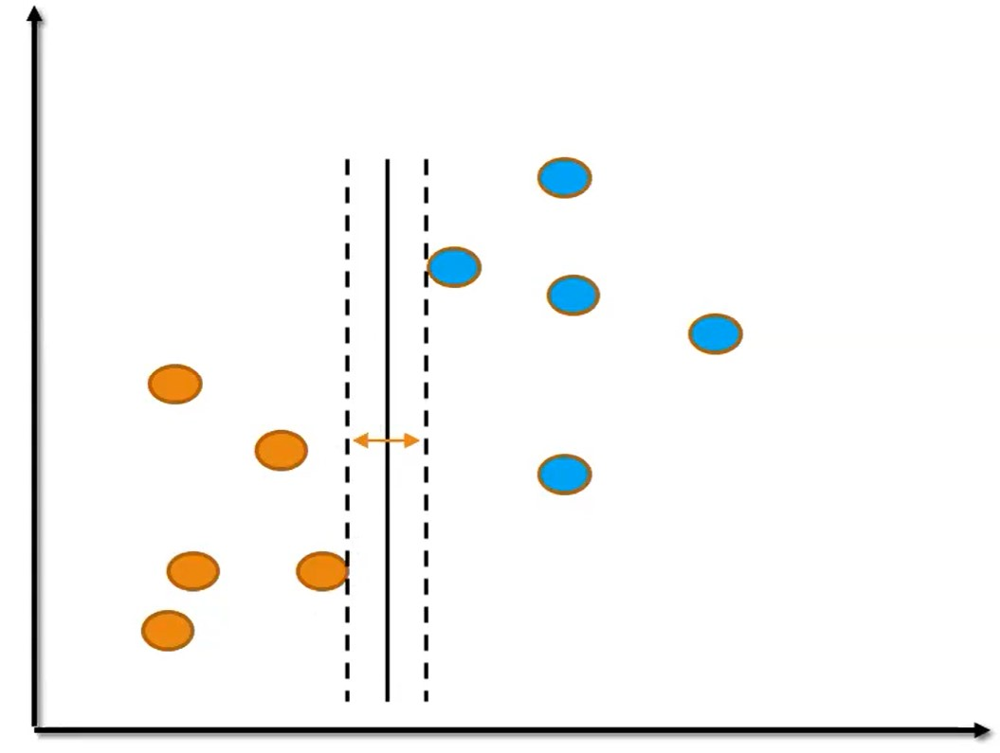

# Máquinas de Vectores de Soporte

Máquinas de Vectores de Soporte (Support Vector Machine - SVM) es un algoritmo de aprendizaje supervisado, por lo que necesitamos tener un conjunto de datos etiquetado para poder usar SVM. Puede ser utilizado para problemas de regresión y clasificación y puede ser de tipo lineal y no lineal. El objetivo principal de SVM es encontrar un hiperplano en un espacio dimensional N (número total de características), que diferencie los puntos de datos. Entonces, necesitamos encontrar un plano que cree el margen máximo entre dos clases de puntos de datos, lo que significa encontrar la línea para la cual la distancia de los puntos más cercanos sea la más lejana posible.

Veamos algunos gráficos donde el algoritmo está tratando de encontrar la distancia máxima entre los puntos más cercanos:

Podemos ver que el tercer gráfico entre líneas es la mayor distancia que podemos observar para poner entre nuestros dos grupos.

Para comprender completamente la terminología de la máquina de vectores de soporte, veamos sus partes:

El margen debe ser igual en ambos lados.

Para resumir algunos usos posibles de los modelos SVM, se pueden usar para:

- Clasificación lineal.

- Clasificación no lineal.

- Regresión lineal.

- Regresión no lineal.

## Efecto de pequeños márgenes

El clasificador de margen máximo separará las categorías. Si estás familiarizado con la compensación de bias-variance (sesgo-varianza), sabrás que si estás poniendo una línea que está muy bien ajustada para tu conjunto de datos, estás reduciendo el bias y aumentando la varianza. Si aún no estás familiarizado, lo que dice es que cuando tienes un bias alto, significa que es posible que tu modelo no esté completamente ajustado a tu conjunto de datos, por lo que tendrá más errores de clasificación, pero si tienes un bias bajo y una varianza alta, significa que tu modelo estará muy, muy bien ajustado a tu conjunto de datos y eso puede conducir a un sobreajuste, lo que significa que funcionará muy bien en tu conjunto de entrenamiento, pero en tu conjunto de prueba tendrá una mayor tasa de error.

Debido a que sus márgenes son tan pequeños, puedes aumentar la posibilidad de clasificar erróneamente nuevos puntos de datos.

¿Cómo podemos hacer frente a eso?

- Aumentar los márgenes al incluir algunos puntos de datos mal clasificados entre sus márgenes. Se puede aumentar el bias y reducir la varianza controlando uno de los hiperparámetros de SVM, el parámetro 'C'.

Un valor bajo de C aumenta el bias y disminuye la varianza. Si los valores son demasiado extremos, es posible que no se adapte bien.

Un valor alto de C disminuye el bias y aumenta la varianza. Si los valores son demasiado extremos, es posible que se sobreajuste.

Podemos determinar el mejor valor de C haciendo una validación cruzada o ajustando con el conjunto de validación.

**¿Qué otros hiperparámetros se pueden optimizar para Máquinas de Vectores de Soporte?**

- Kernel: El kernel se decide sobre la base de la transformación de datos. De forma predeterminada, el kernel es el kernel de función de base radial (RBF). Podemos cambiarlo a lineal o polinomial dependiendo de nuestro conjunto de datos.

- C parameter: El parámetro c es un parámetro de regularización que le dice al clasificador cuánto error de clasificación debe evitar. Si el valor de C es alto, el clasificador se ajustará muy bien a los datos de entrenamiento, lo que podría causar un sobreajuste. Un valor bajo de C podría permitir más clasificaciones erróneas (errores) que pueden conducir a una menor precisión para nuestro clasificador.

- Gamma: Gamma es un parámetro de hiperplano no lineal. Los valores altos indican que se pueden agrupar puntos de datos que están muy cerca unos de otros. Un valor bajo indica que los puntos de datos se pueden agrupar incluso si están separados por grandes distancias.

Para conocer la lista completa de hiperparámetros de SVM que se pueden ajustar, vaya a la siguiente documentación de aprendizaje de scikit:

https://scikit-learn.org/stable/modules/generated/sklearn.svm.SVC.html

**¿Por qué es importante escalar funciones antes de usar SVM?**

SVM intenta ajustarse a la brecha más amplia entre todas las clases, por lo que las características sin escalar pueden causar que algunas características tengan un impacto significativamente mayor o menor en la forma en que se crea la división de SVM.

**¿Puede SVM producir una puntuación de probabilidad junto con su predicción de clasificación?**

No.

Fuente:

https://medium.com/analytics-vidhya/how-to-build-a-simple-sms-spam-filter-with-python-ee777240fc

https://projectgurukul.org/spam-filtering-machine-learning/

https://medium.com/@bedigunjit/simple-guide-to-text-classification-nlp-using-svm-and-naive-bayes-with-python-421db3a72d34

